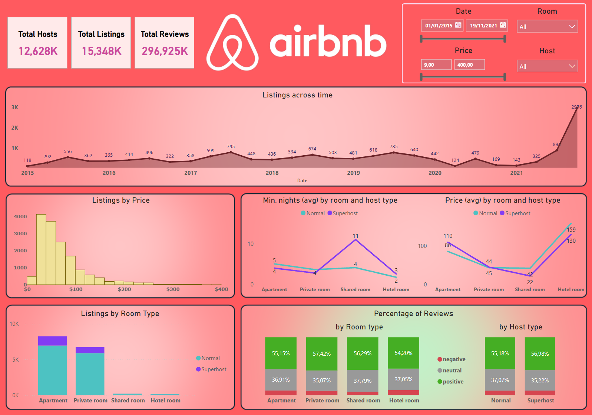

# Airbnb Data Analysis

This repository contains a Power BI project analyzing Airbnb data. The dashboard provides detailed insights into metrics such as total hosts, total listings, total reviews, pricing trends, and room type distribution.

## Dashboard Overview

The Airbnb Dashboard offers a comprehensive analysis of Airbnb's operational data. It highlights key statistics and trends that provide insights into host activities, pricing strategies, and guest preferences.

### Key Metrics

- **Total Hosts**: The total number of hosts on Airbnb.
- **Total Listings**: The total number of active listings on Airbnb.
- **Total Reviews**: The total number of reviews left by guests.

### Detailed Insights

- **Listings Across Time**: A line chart displaying the change in number of listings over the years.
- **Listings by Price**: A histogram showing the distribution of listings across various price ranges.
- **Listings by Room Type**: A bar chart displaying the distribution of listings among different room types like apartments, private rooms, shared rooms, and hotel rooms.
- **Min. Nights (Avg) by Room and Host Type**: A line chart indicating the average minimum nights required for different types of rooms, comparing normal hosts to superhosts.
- **Price (Avg) by Room and Host Type**: A line chart showing the average price for different room types, comparing normal hosts to superhosts.
- **Percentage of Reviews by Room Type**: A bar chart showing the distribution of review percentages across different room types.
- **Percentage of Reviews by Host Type**: A bar chart comparing review percentages (positive, neutral, negative) between normal hosts and superhosts.

## Data Sources and Integration

The data for this dashboard is sourced from a Snowflake database, where tables are organized and transformed using DBT (Data Build Tool). This setup allows for efficient data handling and transformation, ensuring accurate and up-to-date information feeds into the Power BI visualizations. Connecting Power BI to Snowflake enables real-time data analytics and visualization capabilities, providing a dynamic tool for monitoring Airbnb's marketplace metrics.