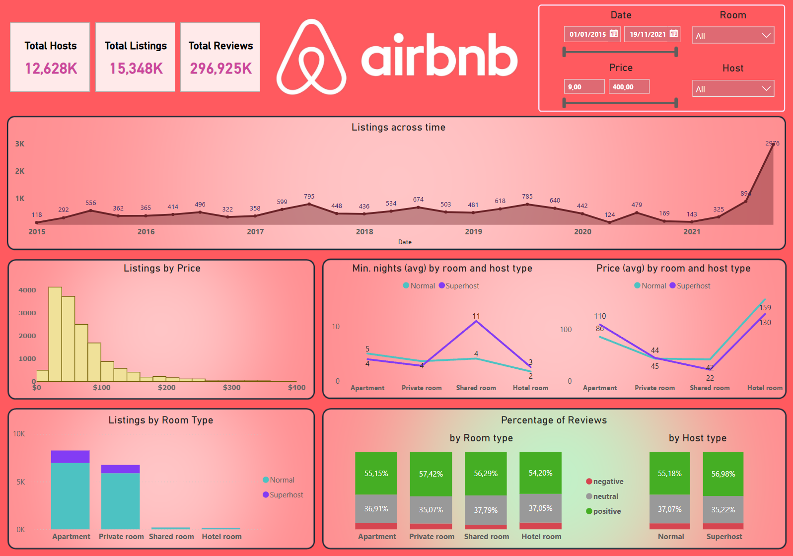
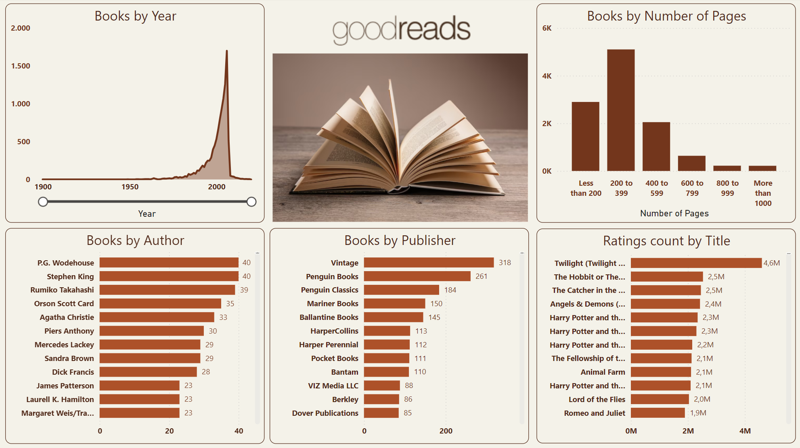
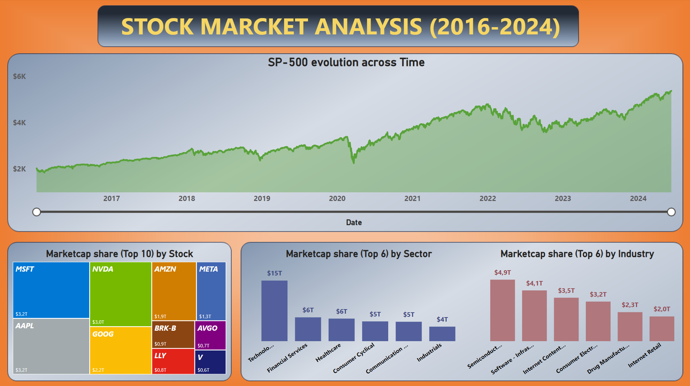
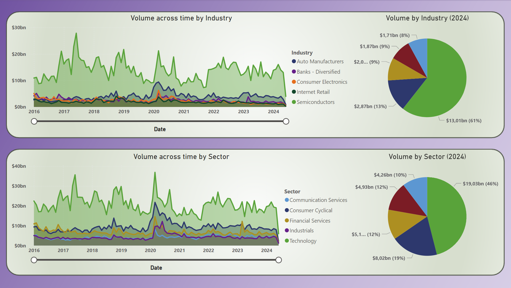
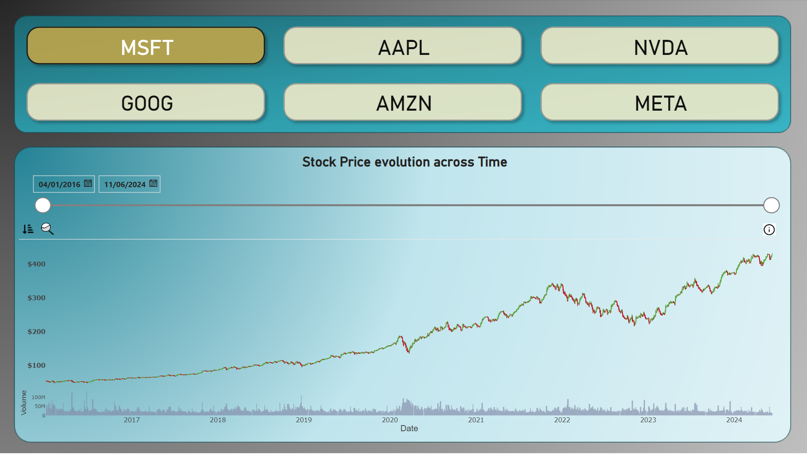

# Power BI Projects

This repository contains various Power BI projects that analyze different datasets to provide valuable insights through interactive dashboards. Each project focuses on a specific domain, presenting key metrics and trends.

## Projects Overview

### 1. [Airbnb](./Airbnb)

This project analyzes Airbnb data, providing insights into the platform's operations, including total hosts, total listings, total reviews, pricing trends, and room type distribution.

#### Dashboard Preview

#### Key Metrics
- **Total Hosts**
- **Total Listings**
- **Total Reviews**
- **Listings Across Time**
- **Listings by Price**
- **Listings by Room Type**
- **Min. Nights (Avg) by Room and Host Type**
- **Price (Avg) by Room and Host Type**
- **Percentage of Reviews by Room Type**
- **Percentage of Reviews by Host Type**

### 2. [Amazon Prime Video](./Amazon-Prime-Video)

This project analyzes Amazon Prime Video data, providing insights into the platform's content library, including total titles, ratings, genres, directors, and more.

#### Dashboard Preview

#### Key Metrics
- **Total Titles**
- **Total Ratings**
- **Total Genres**
- **Total Directors**
- **Total Countries**
- **Release Year**
- **Ratings by Total Shows**
- **Genres by Total Shows**
- **Total Shows by Country**
- **Movies and TV Shows**
- **Total Shows by Release Year**

### 3. [Bookreads](./Goodreads-Analytics)

This project analyzes Goodreads data, providing insights into the book database, including metrics such as books by year, number of pages, authors, publishers, and more.

#### Dashboard Preview

#### Key Metrics
- **Books by Year**
- **Books by Number of Pages**
- **Books by Author**
- **Books by Publisher**
- **Ratings Count by Title**

### 4. [HR Analytics](./HR-Analytics)

This project analyzes HR data, providing insights into various HR metrics, including employee attrition, job satisfaction, and demographic analysis.

#### Dashboard Preview

#### Key Metrics
- **Number of Employees**
- **Attrition**
- **Attrition Rate**
- **Active Employees**
- **Average Age**
- **Attrition by Department**
- **Employees by Age group and Gender**
- **Job Satisfaction Rating**
- **Attrition by Education Field**
- **Attrition By Gender for Different Age Groups**

### 5. [Stock Market Analysis](./Stock-Market)

This project analyzes the S&P 500 stock market data from 2016 to 2024, providing insights into market trends, sector performance, and trading volumes.

#### Dashboard Preview

#### Key Metrics
- **SP-500 evolution across Time**
- **Marketcap share (Top 10) by Stock**
- **Marketcap share (Top 7) by Sector**
- **Marketcap share (Top 7) by Industry**
- **Volume across time by Industry**
- **Volume by Industry (2024)**
- **Volume across time by Sector**
- **Volume by Sector (2024)**
- **Stock Price evolution across Time**

## Conclusion
Each project in this repository provides valuable insights into different domains through interactive and comprehensive Power BI dashboards. Feel free to explore the data and share your insights!

If you have any questions or need further assistance, please feel free to contact me.