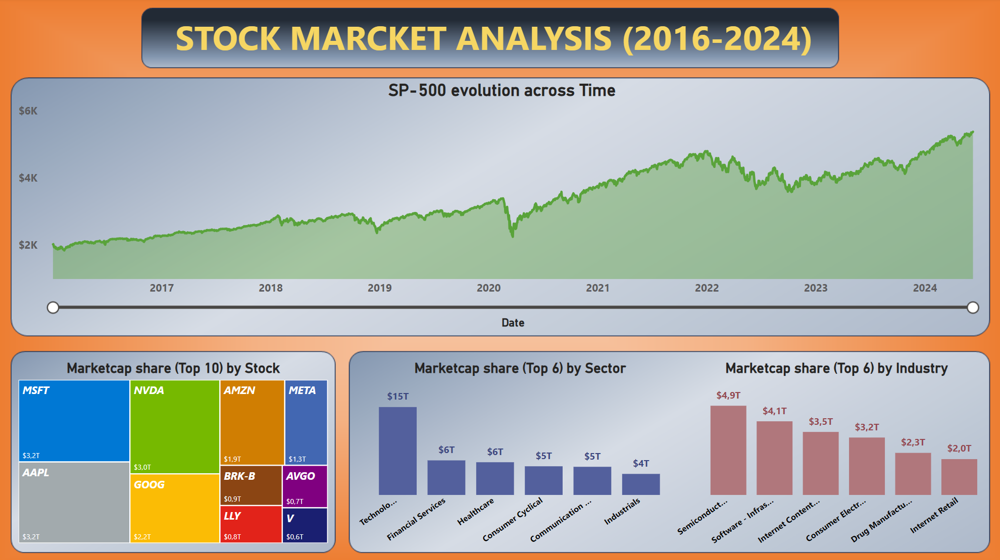
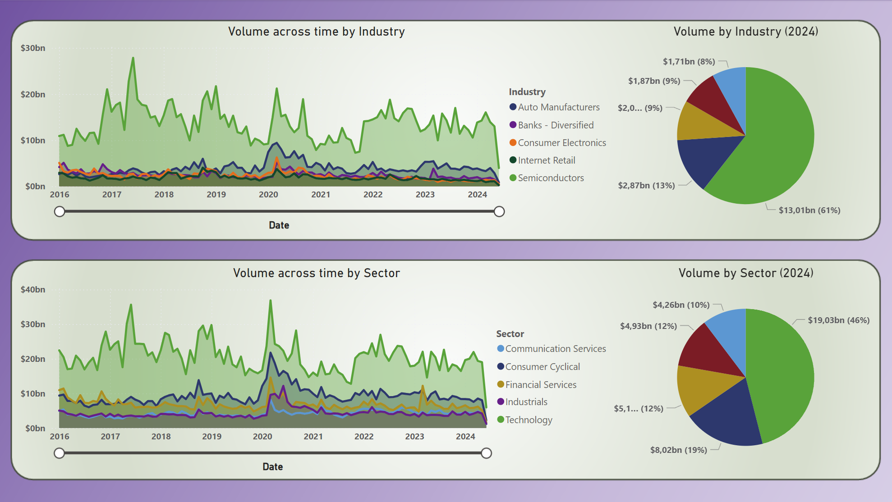
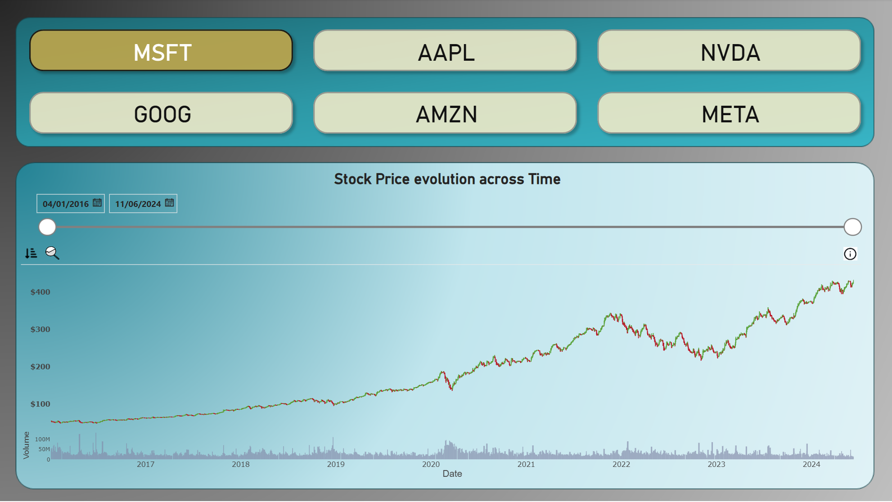

# Stock Market Analysis (2016-2024)

This repository contains a Power BI project analyzing the S&P 500 stock market data from 2016 to 2024. The dataset used for this analysis is sourced from Kaggle and includes detailed information on S&P 500 stocks.

## Dataset

The dataset used in this project is available on Kaggle: [S&P 500 Stocks Dataset](https://www.kaggle.com/datasets/andrewmvd/sp-500-stocks).

### Data Files

The `sp500_data` folder contains the following CSV files:

- `sp500_companies.csv`: Information about the companies listed in the S&P 500.
- `sp500_index.csv`: Historical data of the S&P 500 index.
- `sp500_stocks.csv`: Historical stock prices and other related information for the companies listed in the S&P 500.

## Dashboards

### 1. Stock Market Overview

This dashboard provides an overview of the S&P 500 market performance over the years, highlighting key metrics and trends.

- **SP-500 evolution across Time**: A line chart showing the growth of the S&P 500 index from 2016 to 2024.
- **Marketcap share (Top 10) by Stock**: A treemap visualizing the market capitalization share of the top 10 stocks.
- **Marketcap share (Top 7) by Sector**: A bar chart showing the market capitalization share of the top 6 sectors.
- **Marketcap share (Top 7) by Industry**: A bar chart showing the market capitalization share of the top 6 industries.

### 3. Trading Volume Analysis

This dashboard focuses on the trading volume of stocks across different industries and sectors.

- **Volume across time by Industry**: An area chart showing the trading volume trends for various industries from 2016 to 2024.
- **Volume by Industry (2024)**: A pie chart illustrating the trading volume distribution among industries for the year 2024.
- **Volume across time by Sector**: An area chart showing the trading volume trends for different sectors from 2016 to 2024.
- **Volume by Sector (2024)**: A pie chart illustrating the trading volume distribution among sectors for the year 2024.

### 2. Stock Price Analysis

This dashboard allows for an in-depth analysis of individual stock prices over time.

- **Stock Price evolution across Time**: A line chart showing the stock price trends for selected companies from 2016 to 2024.
Users can select different stocks to view their specific trends.